# Online Store (Diploma Project)

## Description
Full-stack web application — online store developed as a bachelor diploma project.
The project includes frontend, backend, database integration, and third-party API usage.

## Features
- Product catalog
- Product detail pages
- Shopping cart
- Order form with validation
- Delivery address selection
- Integration with Nova Poshta API (cities, warehouses)
- Dynamic delivery location selection
- REST API integration

## Tech Stack
**Frontend:**
- React
- Next.js

**Backend:**
- Node.js
- Express.js

**Database:**
- MySQL
- Prisma ORM

**Other:**
- REST API
- Git / GitHub
- Deployment: Vercel

## Nova Poshta API
The project integrates the Nova Poshta API to:
- Fetch list of cities
- Fetch available warehouses by selected city
- Provide dynamic delivery location selection during checkout

# Screenshots

Нижче наведені скріншоти інтерфейсу та функціоналу проекту:

### Головна сторінка
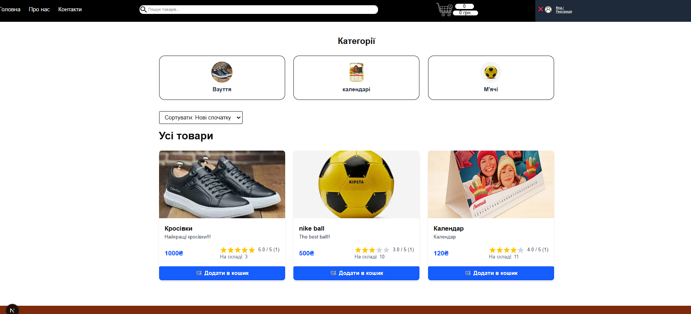
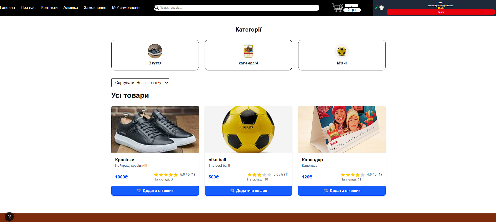

### Продукти
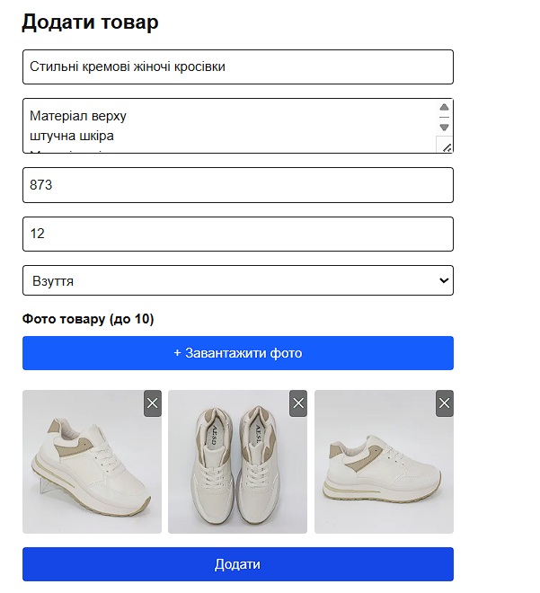
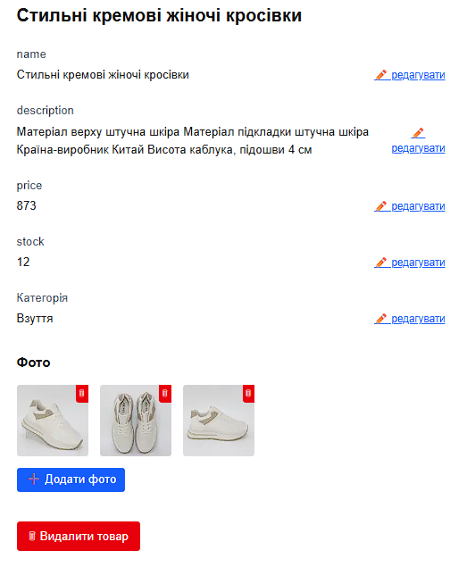


### Кошик та замовлення
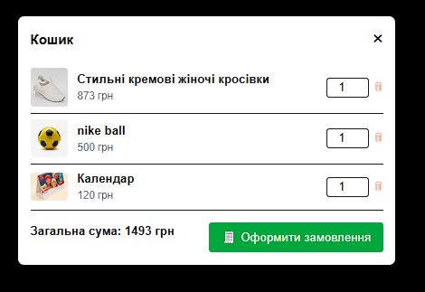
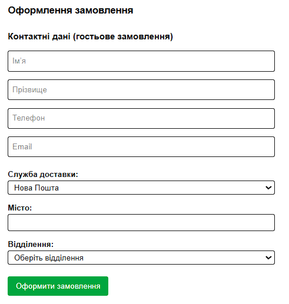

### Фільтри та пошук


### Реєстрація та логін
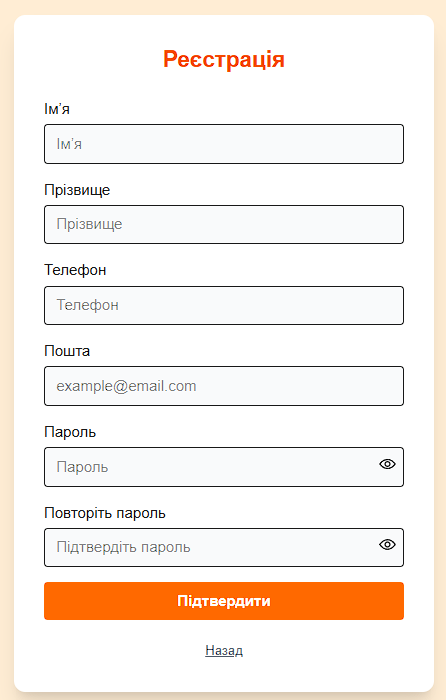
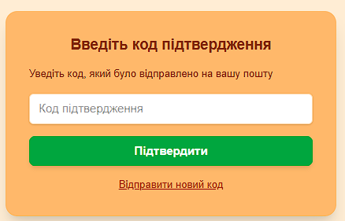

### Інтеграції
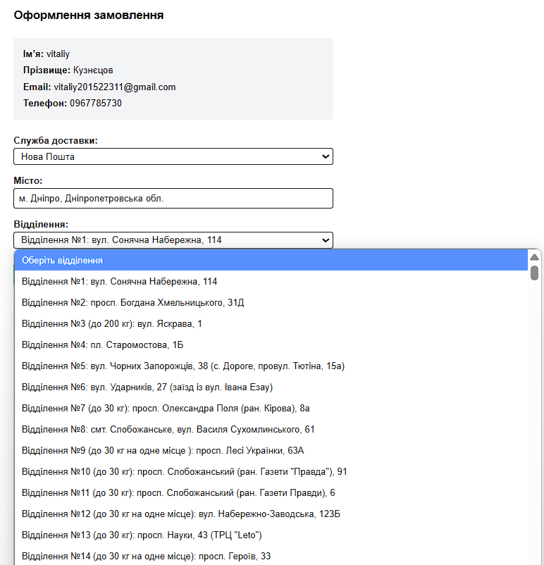

### База даних
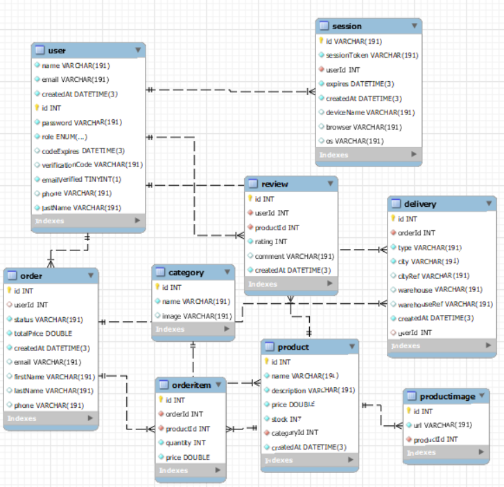

### Діаграми та кейси
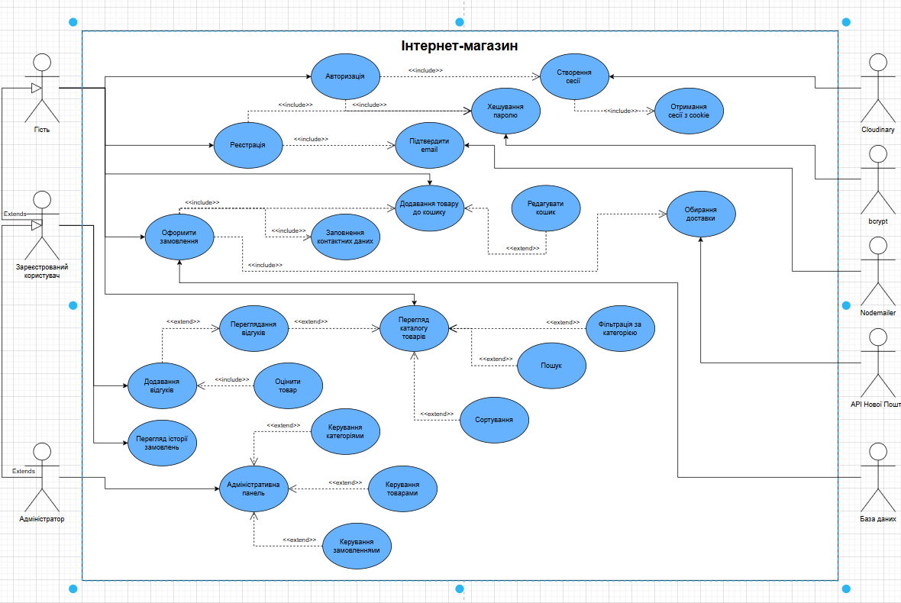


## Getting Started

### 1. Clone repository
```bash
git clone https://github.com/your-username/online_store.git
cd online_store

